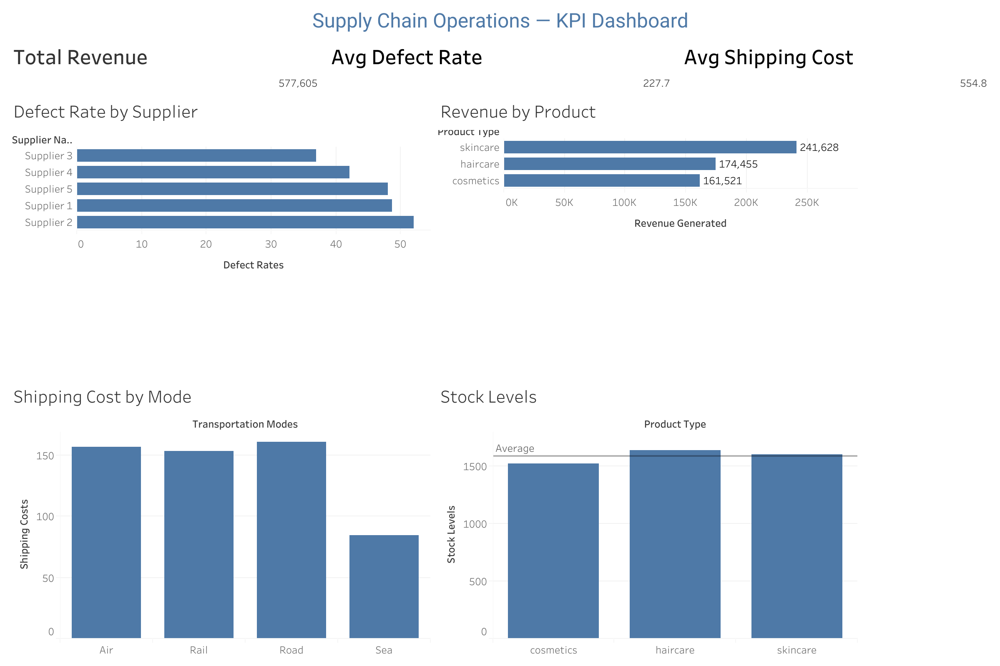

# Supply Chain Operations Analytics Dashboard

A business analysis and reporting project demonstrating end-to-end BA practice — from requirements documentation through to a stakeholder-facing Tableau dashboard built on real supply chain data.

[View Live Dashboard](https://public.tableau.com/app/profile/jay.sangani/viz/Book1_17764193026100/SupplyChainOperationsKPIDashboard)

---

## Business problem

Operations teams managing multi-product supply chains often lack consolidated visibility into delivery performance, cost efficiency, and stock availability. Without a unified reporting layer, decisions are reactive rather than data-driven.

This project simulates a BA engagement where I was tasked with defining reporting requirements, documenting the current state process, and delivering a dashboard that gives operations stakeholders real-time KPI visibility.

---

## What I delivered

| Artefact | Location | Description |
|---|---|---|
| Tableau Dashboard | Live link above | 4-view stakeholder-facing KPI dashboard |
| SQL KPI Queries | `/sql/` | Data exploration and KPI extraction queries |
| Python Data Cleaning | `/analysis/` | Cleaning and preparation of raw dataset |
| Cleaned Dataset | `/data/` | Production-ready CSV used by the dashboard |

---

## Dashboard views

1. **KPI summary** — Total revenue, average defect rate, average shipping cost
2. **Revenue by product** — Revenue comparison across skincare, haircare, and cosmetics
3. **Defect rate by supplier** — Quality performance ranked across 5 suppliers
4. **Shipping cost by transport mode** — Cost comparison across Air, Rail, Road, and Sea

---

## Key findings

- Supplier 2 has the highest defect rate across all product lines — a risk to product quality
- Skincare generates 43% of total revenue despite similar stock levels to other categories
- Sea freight costs significantly less than other modes — potential cost saving opportunity if lead times allow
- All three product categories are near the average stock threshold — limited buffer for demand spikes

---

## Dataset

**Source:** [Supply Chain Analysis — Kaggle](https://www.kaggle.com/datasets/harshsingh2209/supply-chain-analysis)
**Size:** ~100 products across 3 categories and 5 suppliers
**Format:** CSV

---

## Tools used

- **Python** — pandas for data cleaning and preparation
- **SQL** — Data exploration and KPI extraction
- **Tableau Public** — Dashboard development and publishing

---

## Folder structure
supply-chain-analytics/
├── README.md
├── data/
│   ├── raw_supply_chain.csv
│   └── cleaned_supply_chain.csv
├── sql/
│   ├── 01_data_exploration.sql
│   └── 02_kpi_queries.sql
├── analysis/
│   └── data_cleaning_supply_chain.py
└── dashboard/
└── dashboard_screenshot.png

---

## How to run the analysis

1. Download the dataset from the Kaggle link above and place in `/data/raw_supply_chain.csv`
2. Run `python analysis/data_cleaning_supply_chain.py` to produce the cleaned CSV
3. Open the SQL queries in `/sql/` to explore the data
4. View the live dashboard using the link at the top of this page

---

*Part of my BA portfolio — see also: [customer-segmentation-ba](https://github.com/JaySangani/customer-segmentation-ba)*